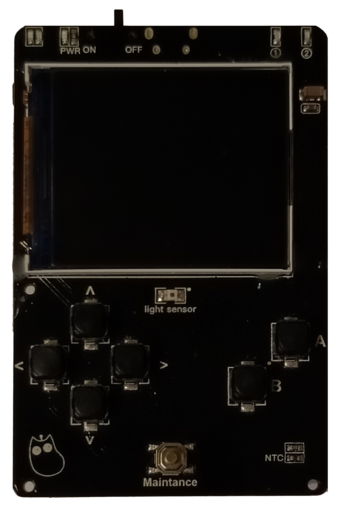

# Reversing-Meowbit-v1
Hardware reversing of the MeowBit device developed by KittenBot for the Xueersi Coding platform.

 

## Leds

## Buttons

| Button    | Pin       | GPIO      | Mode         |
| --------- | --------- | --------- | ------------ |
| ↑         | 24        | 2         | INPUT_PULLUP |
| ↓         | 16        | 13        | INPUT_PULLUP |
| ←         | 12        | 27        | INPUT_PULLUP |
| →         | 7         | 35        | INPUT        |
| A         | 6         | 34        | INPUT        |
| B         | 14        | 12        | INPUT_PULLUP |

## Sensors

## Display
